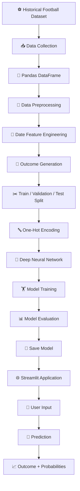
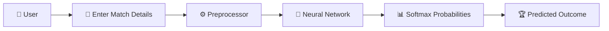

# ⚽ International Football Match Outcome Predictor

<div align="center">

### 🧠 Deep Learning • Football Analytics • Multi-Class Prediction

**Predict International Football Match Outcomes using a Neural Network**

<br>

[](https://www.python.org/)
[](https://www.tensorflow.org/)
[](https://keras.io/)
[](https://pandas.pydata.org/)
[](https://scikit-learn.org/)
[](https://streamlit.io/)

</div>

---

## 🏟️ Project Overview

**International Football Match Outcome Predictor** is a deep learning project that analyzes historical international football match data and classifies a match into one of three possible outcomes:

| Class  | Outcome  |
| ------ | -------- |
| 🟡 `0` | Draw     |
| 🟢 `1` | Home Win |
| 🔵 `2` | Away Win |

The project combines:

* 📊 Historical football data
* 🧹 Data preprocessing
* 🔤 One-hot encoding
* 🧠 Artificial Neural Networks
* 📈 Model evaluation
* 💾 Model serialization
* 🌐 Streamlit deployment

The trained neural network is exposed through an interactive Streamlit interface where users can enter match information and receive a predicted outcome with class probabilities.

---

## ✨ Key Features

### ⚽ Match Outcome Classification

Predicts one of three outcomes:

**Draw · Home Win · Away Win**

### 🧠 Deep Neural Network

The model contains multiple fully connected layers:

```text
Input Features
      │
      ▼
┌─────────────────┐
│ Dense 256 ReLU  │
└────────┬────────┘
         │
         ▼
┌─────────────────┐
│ Dropout 30%     │
└────────┬────────┘
         │
         ▼
┌─────────────────┐
│ Dense 128 ReLU  │
└────────┬────────┘
         │
         ▼
┌─────────────────┐
│ Dropout 30%     │
└────────┬────────┘
         │
         ▼
┌─────────────────┐
│ Dense 64 ReLU   │
└────────┬────────┘
         │
         ▼
┌─────────────────┐
│ Dense 3 Softmax │
└────────┬────────┘
         │
         ▼
   Match Outcome
```

### 🌍 Historical Data

The project uses the **International Football Results from 1872 to 2017** dataset.

The dataset is downloaded through KaggleHub and loaded into a Pandas DataFrame.

### 🔤 Categorical Feature Encoding

Categorical variables are transformed using:

```text
OneHotEncoder
```

The preprocessing pipeline handles:

* Home Team
* Away Team
* Tournament
* City
* Country

### 🖥️ Interactive Web Application

The Streamlit interface provides input controls for:

* 🏠 Home Team
* ✈️ Away Team
* 🥅 Home Score
* 🥅 Away Score
* 🗓️ Year
* 📅 Month
* 🏆 Tournament
* 🏙️ City
* 🌍 Country
* 🏟️ Neutral Venue

The application then displays:

> 🎯 Predicted Match Outcome
> 📊 Class Confidence / Probabilities

---

# 🧩 System Architecture



---

# 🔬 Machine Learning Pipeline

The project follows a standard machine learning workflow.

```text
        DATA
         │
         ▼
   ┌───────────────┐
   │ Data Loading  │
   └───────┬───────┘
           │
           ▼
   ┌───────────────┐
   │ Preprocessing  │
   └───────┬───────┘
           │
           ▼
   ┌───────────────┐
   │ Feature        │
   │ Engineering    │
   └───────┬───────┘
           │
           ▼
   ┌───────────────┐
   │ Train / Val / │
   │ Test Split    │
   └───────┬───────┘
           │
           ▼
   ┌───────────────┐
   │ One-Hot       │
   │ Encoding      │
   └───────┬───────┘
           │
           ▼
   ┌───────────────┐
   │ Neural        │
   │ Network       │
   └───────┬───────┘
           │
           ▼
   ┌───────────────┐
   │ Training      │
   └───────┬───────┘
           │
           ▼
   ┌───────────────┐
   │ Evaluation    │
   └───────┬───────┘
           │
           ▼
      ⚽ PREDICTION
```

---

# 📊 Dataset

The project uses the Kaggle dataset:

**International Football Results from 1872 to 2017**

The dataset contains historical international football match information.

Important columns used by the project include:

| Feature      | Description              |
| ------------ | ------------------------ |
| `home_team`  | Home team                |
| `away_team`  | Away team                |
| `home_score` | Home team score          |
| `away_score` | Away team score          |
| `date`       | Match date               |
| `tournament` | Tournament / competition |
| `city`       | Match location           |
| `country`    | Country                  |
| `neutral`    | Whether venue is neutral |

Additional engineered features:

```text
year
month
outcome
```

---

# 🎯 Target Variable

The project converts match scores into a three-class target.

```python
if home_score == away_score:
    outcome = 0
elif home_score > away_score:
    outcome = 1
else:
    outcome = 2
```

Therefore:

```text
0 → Draw
1 → Home Win
2 → Away Win
```

---

# 🧠 Deep Learning Architecture

The neural network is implemented using TensorFlow/Keras.

### Architecture

```text
Input Layer
     │
     ▼
Dense(256)
ReLU Activation
     │
     ▼
Dropout(0.3)
     │
     ▼
Dense(128)
ReLU Activation
     │
     ▼
Dropout(0.3)
     │
     ▼
Dense(64)
ReLU Activation
     │
     ▼
Dense(3)
Softmax Activation
     │
     ▼
Prediction
```

### Model Configuration

| Parameter          | Value                           |
| ------------------ | ------------------------------- |
| Framework          | TensorFlow / Keras              |
| Architecture       | Sequential ANN                  |
| Hidden Layers      | 3                               |
| First Dense Layer  | 256 neurons                     |
| Second Dense Layer | 128 neurons                     |
| Third Dense Layer  | 64 neurons                      |
| Dropout            | 30%                             |
| Output Neurons     | 3                               |
| Output Activation  | Softmax                         |
| Optimizer          | Adam                            |
| Loss               | Sparse Categorical Crossentropy |
| Epochs             | 10                              |
| Batch Size         | 32                              |

---

# 🏋️ Training Strategy

The dataset is divided into:

```text
                 Complete Dataset
                        │
             ┌──────────┴──────────┐
             │                     │
           80%                   20%
          Train                 Test
             │
             ▼
       ┌─────────────┐
       │             │
      75%           25%
     Training    Validation
```

The notebook uses stratified splitting to maintain class distribution across the datasets.

### Dataset Split

```text
Training      → 60%
Validation    → 20%
Testing       → 20%
```

---

# 📈 Model Evaluation

After training, the model is evaluated against the held-out test dataset.

The notebook reports:

```text
Test Loss
Test Accuracy
```

The training process also tracks:

```text
Training Loss
Validation Loss
Training Accuracy
Validation Accuracy
```

This allows the model's learning behavior to be inspected during training.

---

# 🌐 Streamlit Application

The project includes an interactive web application built using **Streamlit**.

### Application Flow



The application loads two saved artifacts:

```text
preprocessor.pkl
football_match_predictor_model.h5
```

The preprocessing pipeline transforms the user's input before passing it to the trained neural network.

---

# 🖥️ Application Preview

```text
╔════════════════════════════════════════════╗
║       ⚽ INTERNATIONAL FOOTBALL             ║
║          MATCH PREDICTOR 🥅                ║
╠════════════════════════════════════════════╣
║                                            ║
║  🏠 Home Team       [ England          ]   ║
║  ✈️ Away Team       [ Scotland         ]   ║
║  🥅 Home Score      [ 1                ]   ║
║  🥅 Away Score      [ 1                ]   ║
║  🗓️ Year             [ 2024             ]   ║
║  📅 Month            [ July             ]   ║
║  🏆 Tournament       [ Friendly         ]   ║
║  🏙️ City              [ London           ]   ║
║  🌍 Country           [ England          ]   ║
║  🏟️ Neutral Venue    [ ✓ / ✗            ]   ║
║                                            ║
║           [ 🚀 PREDICT OUTCOME ]           ║
║                                            ║
║  🎯 Prediction: HOME WIN                   ║
║                                            ║
╚════════════════════════════════════════════╝
```

---

# 📁 Project Structure

Recommended repository structure:

```text
International-Football-Predictor/
│
├── 📓 International_football_results_(2).ipynb
│
├── 🐍 app.py
│
├── 🧠 football_match_predictor_model.h5
│
├── ⚙️ preprocessor.pkl
│
├── 📄 requirements.txt
│
└── 📖 README.md
```

---

# ⚙️ Installation

Clone the repository:

```bash
git clone <YOUR_REPOSITORY_URL>
cd International-Football-Predictor
```

Create a virtual environment:

```bash
python -m venv venv
```

Activate it.

### Windows

```bash
venv\Scripts\activate
```

### Linux / macOS

```bash
source venv/bin/activate
```

Install dependencies:

```bash
pip install tensorflow pandas numpy scikit-learn scipy joblib streamlit kagglehub
```

---

# 🚀 Run the Application

Start Streamlit:

```bash
streamlit run app.py
```

The application will be available locally at:

```text
http://localhost:8501
```

---

# 🔮 Prediction Workflow

The prediction process works as follows:

```text
User Input
    │
    ▼
Create DataFrame
    │
    ▼
Load preprocessor.pkl
    │
    ▼
Transform Features
    │
    ▼
Load Neural Network
    │
    ▼
model.predict()
    │
    ▼
Softmax Probabilities
    │
    ▼
argmax()
    │
    ▼
┌─────────────────────┐
│ 0 → Draw            │
│ 1 → Home Win        │
│ 2 → Away Win        │
└─────────────────────┘
```

---

# 🛠️ Technologies Used

<div align="center">

| Technology      | Purpose                        |
| --------------- | ------------------------------ |
| 🐍 Python       | Core programming language      |
| 🐼 Pandas       | Data manipulation              |
| 🔢 NumPy        | Numerical computation          |
| 🤖 TensorFlow   | Deep learning framework        |
| 🧠 Keras        | Neural network implementation  |
| 📊 Scikit-learn | Preprocessing & data splitting |
| 💾 Joblib       | Preprocessor serialization     |
| 🌐 Streamlit    | Interactive web application    |
| 📦 KaggleHub    | Dataset acquisition            |
| 🧮 SciPy        | Sparse matrix handling         |

</div>

---

# 🔐 Model Persistence

The trained components are saved for reuse.

### Preprocessing Pipeline

```text
preprocessor.pkl
```

Stores the fitted preprocessing configuration, including categorical encoding.

### Neural Network

```text
football_match_predictor_model.h5
```

Stores the trained TensorFlow/Keras model.

This allows the Streamlit application to load the trained pipeline without retraining the model every time.

---

# ⚠️ Important Model Limitation — Target Leakage

> **This is an important consideration for anyone evaluating this project as a real predictive system.**

The current notebook derives the target `outcome` directly from:

```text
home_score
away_score
```

while also using:

```text
home_score
away_score
```

as model input features.

That means the model receives information that directly determines the answer.

Conceptually:

```text
home_score + away_score
          │
          ▼
       outcome
          ▲
          │
     MODEL INPUT
```

This creates **target leakage**.

Therefore, the current implementation should be considered primarily a **deep learning / ML pipeline demonstration**, rather than a reliable pre-match prediction system.

### 🔧 Recommended Improvement

For a genuine pre-match prediction model, remove actual match scores from the input features.

Instead, engineer features such as:

```text
🏆 Historical team performance
📈 Recent form
⚽ Average goals scored
🛡️ Average goals conceded
🏠 Home advantage
🌍 FIFA ranking
🏆 Tournament type
📊 Head-to-head statistics
🔥 Winning streak
📉 Losing streak
🏟️ Neutral venue
📅 Season / year
```

This would make the prediction meaningful **before the match begins**.

---

# 🚀 Future Improvements

The project can be significantly upgraded with:

### 🧠 Better Machine Learning

* [ ] Remove target leakage
* [ ] Add recent-form features
* [ ] Add team ranking features
* [ ] Add head-to-head statistics
* [ ] Add rolling averages
* [ ] Add player/team strength indicators
* [ ] Compare ANN with Random Forest, XGBoost and Logistic Regression
* [ ] Hyperparameter tuning
* [ ] Cross-validation

### 📊 Better Evaluation

* [ ] Confusion Matrix
* [ ] Precision
* [ ] Recall
* [ ] F1 Score
* [ ] ROC-AUC
* [ ] Class-wise performance
* [ ] Training/validation curves

### 🌐 Better Application

* [ ] Modern Streamlit UI
* [ ] Team logos
* [ ] Match prediction cards
* [ ] Probability charts
* [ ] Historical team comparison
* [ ] Prediction history
* [ ] Interactive analytics dashboard

### ☁️ Production Deployment

* [ ] Deploy Streamlit application
* [ ] Dockerize application
* [ ] Add API endpoint
* [ ] Add model versioning
* [ ] Add automated model retraining
* [ ] Add monitoring
* [ ] CI/CD pipeline

---

# 🔭 Project Roadmap

```text
                    CURRENT
                       │
                       ▼
             ┌──────────────────┐
             │ Historical Data  │
             └────────┬─────────┘
                      │
                      ▼
             ┌──────────────────┐
             │ Deep Learning    │
             │ Classification   │
             └────────┬─────────┘
                      │
                      ▼
             ┌──────────────────┐
             │ Streamlit App    │
             └────────┬─────────┘
                      │
                      ▼
                   NEXT 🚀
                      │
        ┌─────────────┼─────────────┐
        ▼             ▼             ▼
   Better Data    Better Model   Better UI
        │             │             │
        └─────────────┼─────────────┘
                      ▼
             ┌──────────────────┐
             │ Production-Ready │
             │ Football AI      │
             └──────────────────┘
```

---

# 🎯 Learning Outcomes

This project demonstrates practical experience with:

* 🧠 Deep learning fundamentals
* 🏗️ Neural network architecture
* 🔤 Categorical feature encoding
* 🧹 Data preprocessing
* ✂️ Dataset splitting
* 🏋️ Model training
* 📊 Model evaluation
* 💾 Model serialization
* 🌐 ML application development
* 🚀 Streamlit deployment
* ⚠️ Identifying machine learning data leakage

---

# 🧪 Experimentation

The notebook provides an end-to-end experimentation environment where the complete pipeline can be modified and retrained.

You can experiment with:

```text
Learning Rate
Batch Size
Epochs
Number of Layers
Number of Neurons
Dropout Rate
Features
Optimizers
Activation Functions
```

This makes the project useful as a foundation for further football analytics experiments.

---

# 🤝 Contributing

Contributions are welcome!

```bash
# Fork the repository
# Create a feature branch
git checkout -b feature/improvement

# Commit your changes
git commit -m "Add new football prediction feature"

# Push the branch
git push origin feature/improvement
```

Then open a Pull Request 🚀

---

# 📜 License

This project is intended for educational, experimental, and research purposes.

Add an appropriate open-source license such as **MIT** if you want others to freely reuse and modify the project.

---

# 👨‍💻 Author

<div align="center">

### **Aravind**

🎓 Student • 🤖 AI/ML Enthusiast • 💻 Developer

Building projects at the intersection of **Artificial Intelligence, Software Engineering & Data Science**.

<br>

⭐ **If you found this project interesting, consider giving the repository a star!**

</div>

---

<div align="center">

### ⚽ Built with Python + TensorFlow + Keras + Streamlit

**From historical football data → to neural networks → to predictions. 🧠⚽**

<br>

⭐ Star the repository  •  🍴 Fork the project  •  🐛 Report an issue  •  🚀 Build something better

</div>
